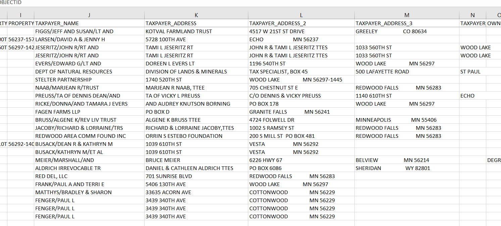

# Cleaning Yellow Medicine County MN Attribute Tables  
author: Robert C. Cline, **Golden Triangle Land Services, Inc.**, Sidney, Nebraska (713) 806-6011

[Yellow Medicine County Website](https://www.co.ym.mn.gov/)

[GIS Datasets](https://shareopendata-yellowmedicine.hub.arcgis.com/datasets/b541e04a4c204811ab3251a980b92138_0/explore?location=44.737651%2C-95.905650%2C10.36)  ^[Dataset License: DISCLAIMER: Yellow Medicine County, MN., and Pro-West and Associates, Inc., makes no representation or warranties, express or implied, with respect to the use or reuse of the data provided herewith, regardless of its format or the means of its transmission. THE DATA IS PROVIDED "AS IS" WITH NO GUARANTEE OR REPRESENTATION ABOUT THE ACCURACY, CURRENCY, SUITABILITY, PERFORMANCE, MERCHANTABILITY, RELIABILITY, OR FITNESS OF THE DATA FOR ANY PARTICULAR PURPOSE. Yellow Medicine County, MN., and Pro-West and Associates, Inc., shall not be liable for any direct, indirect, special, incidental, compensatory or consequential damages or third party claims resulting from the use of this data, even if Yellow Medicine County, MN., and Pro-West and Associates, Inc., has been advised of the possibility of such potential loss or damage. This data may not be used in states that do not allow the exclusion or limitation of incidental or consequential damages.]
[Deed Record Index - Searches Yellow Medicine, MN](https://www.idocmarket.com/Subscription/Subscribe?county=YELMN1)

### The cleaned dataset is named: ***data/taxparcels2024.csv*** 

 

#### Note:  As explained further below, *Mismatched Records* identify the records where taxpayer's city-state appear to be mismatched.  

   

The purpose of this repository is to provide code that will allow data cleaning for Yellow Medicine County MN GIS attribute tables.  

Because of the inconsistent nature of the data, the names and addresses should be carefully reviewed.  
Much of the cleaning has been accomplished with this code, however additional manual cleaning will be necessary.

This material is published under the Creative Commons License which allows you to:

* Share - copy and redistribute the data in any medium or format
* Adapt - remix, transform and build upon the data
* There is no warranty whatsoever.

You must:
  
* Give appropriate credit to the data provider; and
* Provide a link to this repository and the Creative Commons License 

### Yellow Medicine County MN Attribute Tables: A user's nightmare  

* Data is very poorly organized and structured  
* Data content is spread across multiple fields, rather than variables that contain consistent data.  

### *Shape Files* - Yellow Medicine shape files with modified attribute tables:  
* See "shape" folder

### This repository contains are two R scripts which render: (1) *cleaned data*; and (2) *mismatched records*, *viz*.:

1. *data/tax-parcels-cleaned.csv* in which the tax-owner names and addresses have been cleaned. 

2. *data/mismatched_records.csv* 
  - The structure of the original raw data obtained from Yellow Medicine County website was spread across various variables in an inconsistent manner;
  - owner names, for example, were included in multiple address fields inconsistently.
  - To extract the city and state names, the multiple address fields were merged, and mapped to city-state names from 2023 US Census Records.
  - [Click here for US Census data](https://www.census.gov/data/tables/time-series/demo/popest/2020s-total-cities-and-towns.html) 
  - There can be several reasons for mismatch; 
  - Cities which were missing from the US Census Records, or which may have been misspelled on the raw data, were mismatched.
  
3. A reasonable cleaning and reconstruction of taxpayer information (name, address, city, state) was created but I have not been able to clean up 'owner' data fields.  

4. The *cleaning script* uses the ***library(foreign)*** to modify the *.dbf* file.   
  - *Caveat* before writing the *.dbf* file, data must first be written to a data.frame format.  
  - Failure to write a data.frame format will cause the write function in *library(foreign)* to fail. 
  - *Note*:  Library foreign can only write TEXT variables to 256 variables.  
  - *PostgreSQL* does not have TEXT size limitation.  
  - *PostgreSQL* can write up to 1.6MB per row.  
 
  
  - 
